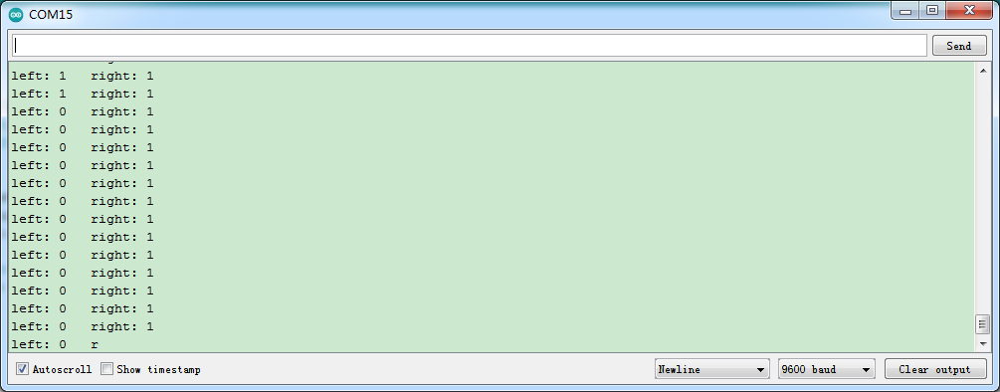

# Arduino


## 1. Arduino简介  

Arduino是一种开源电子原型平台，旨在帮助用户学习电子与编程的基本概念。Arduino开发板（如UNO）支持多种传感器和模块，使用户能够通过简单的编程（基于C/C++语言）构建互动项目。Arduino被广泛应用于教育、创客活动及个人工作室，提供丰富的社区资源与教程，适合各类技术水平的学习者。它的可编程性和灵活性使得它在智能家居、机器人、艺术装置等领域具有广泛应用。  

## 2. 接线图  

  

## 3. 测试代码（测试软件版本：Arduino 1.8.12）  

```arduino  
int leftpin = A3;  
int rightpin = A2;  
int l_val, r_val;  

void setup() {  
    Serial.begin(9600); // 设置波特率  
    pinMode(leftpin, INPUT); // 设置传感器引脚为输入模式  
    pinMode(rightpin, INPUT); // 设置传感器引脚为输入模式  
}  

void loop() {  
    l_val = digitalRead(leftpin); // 读取巡线传感器输出的数字电平  
    r_val = digitalRead(rightpin); // 读取巡线传感器输出的数字电平  
    Serial.print("left: "); // 串口打印值  
    Serial.print(l_val); // 串口打印值  
    Serial.print(" right: ");  
    Serial.println(r_val); // 输出读取到的数值，并自动换行  
    delay(100); // 延迟0.1S  
}  
```  

## 4. 测试结果  

按照上图接好线，烧录好代码，上电后，传感器在检测到黑色时，信号端输出高电平，串口监视器显示1，传感器上D1指示灯熄灭；传感器在检测到白色时，信号端输出低电平，串口监视器显示0，传感器上D1指示灯亮起。旋转电位器可调节灵敏度，将D1调节至亮与不亮的临界点时，灵敏度最高。  




