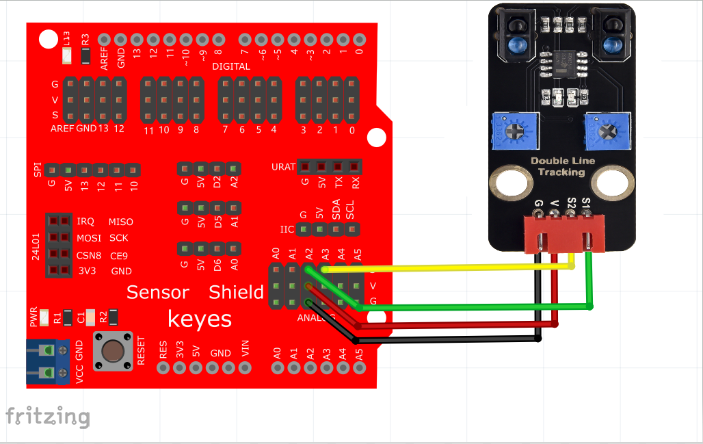
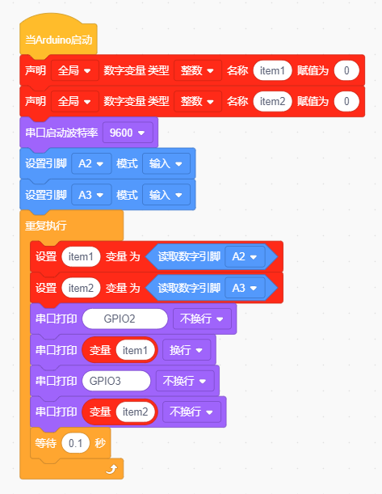
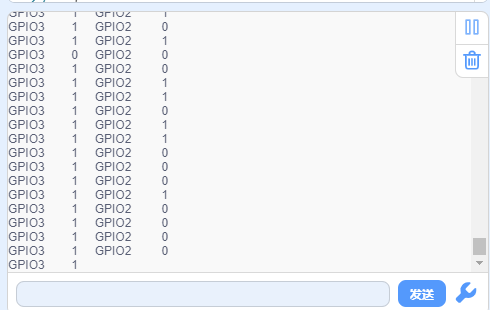

# KidsBlock

## 1. KidsBlock简介  

KidsBlock是一款基于图形化编程的学习平台，旨在让儿童和初学者轻松上手编程与电子项目。使用KidsBlock，用户可以通过拖放模块创建代码，快速实现与硬件交互的功能。该平台支持与Arduino等开发板的集成，提供友好的用户界面和灵活的编程选项，帮助学习者理解基本的编程逻辑和机器人原理。KidsBlock不仅适合个人学习，也常用于教育机构，从而激发孩子们的创造力与STEAM技能。  

## 2. 接线图  

  

## 3. 测试代码（软件测试版本：KidsBlock Desktop 1.1.2）  

  

## 4. 测试结果  

按照上图接好线，烧录好代码，上电后，传感器在检测到黑色时，信号端输出高电平，串口监视器显示1，传感器上D1指示灯熄灭；传感器在检测到白色时，信号端输出低电平，串口监视器显示0，传感器上D1指示灯亮起。旋转电位器可调节灵敏度，将D1调节至亮与不亮的临界点时，灵敏度最高。  

