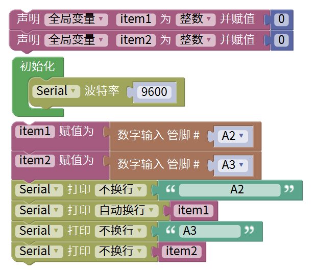
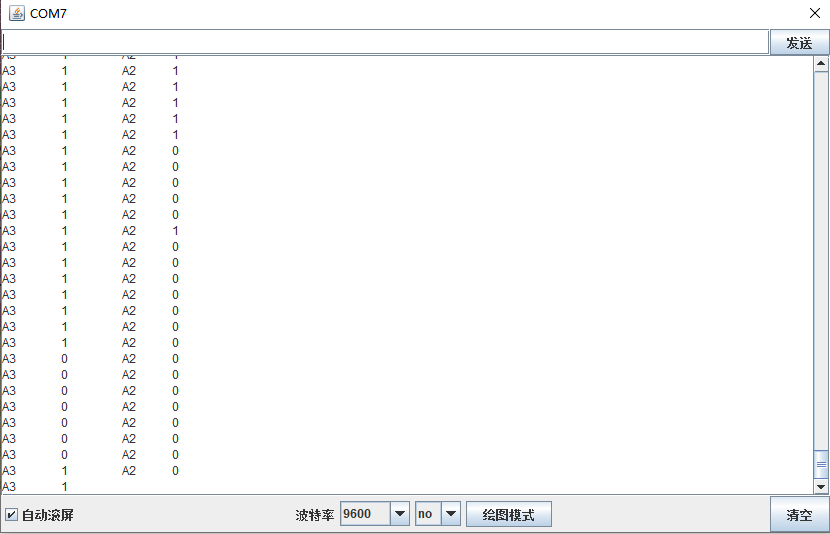

# Mixly

## 1. Mixly简介  

Mixly是一款基于图形化编程的学习平台，专为儿童和初学者设计，致力于让编程与电子项目变得简单易懂。利用Mixly，用户可以通过拖放模块创建代码，实现与Arduino等开发板的互动。该平台支持多种编程语言，包括Scratch和Arduino C，提供友好的用户界面和丰富的示例，鼓励用户探索和创造。Mixly倡导提高学生的创造力和实践能力，特别适合教育机构和青少年学习。  

## 2. 接线图  

  

## 3. 测试代码（软件测试版本：Mixly 1.2.0）  

  

## 4. 测试结果  

按照上图接好线，烧录好代码，上电后，传感器在检测到黑色时，信号端输出高电平，串口监视器显示1，传感器上D1指示灯熄灭；传感器在检测到白色时，信号端输出低电平，串口监视器显示0，传感器上D1指示灯亮起。旋转电位器可调节灵敏度，将D1调节至亮与不亮的临界点时，灵敏度最高。  

