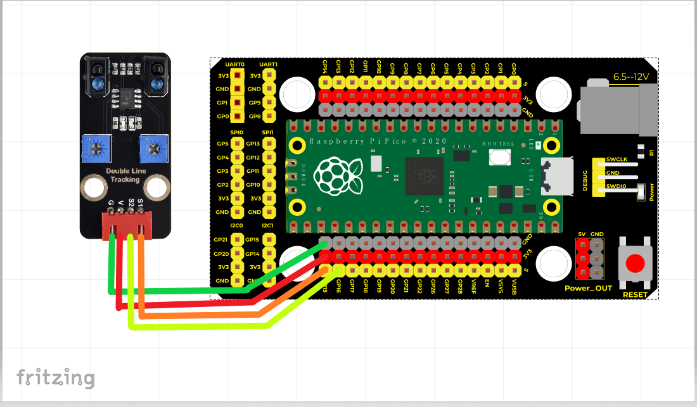
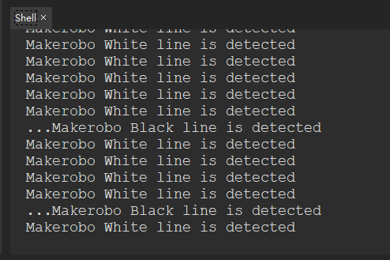

# Python


## 1. Python简介  

Python是一种广泛使用的高级编程语言，以其简洁易读的语法和强大的功能而闻名。它支持多种编程范式，包括面向对象、过程式和函数式编程，使得开发者能够根据项目需求选择合适的风格。Python有着丰富的标准库和第三方模块，适合多种应用，如Web开发、数据分析、人工智能和自动化。此外，Python在教育领域也被广泛应用，因其易于学习的特点而成为许多编程课程的首选语言。  

## 2. 接线图  

  

| 树莓派PICo | 巡线传感器 |  
| ---------- | ----------- |  
| 3.3V      | V           |  
| GND       | G           |  
| GPIO15    | S1          |  
| GPIO16    | S2          |  

## 3. 测试代码（测试软件版本：Thonny 3.3.3）  

```python  
import machine  
import utime  

S1 = machine.Pin(15, machine.Pin.IN, machine.Pin.PULL_UP)  # 设置GPIO15为按键输入  
S2 = machine.Pin(16, machine.Pin.IN, machine.Pin.PULL_UP)  # 设置GPIO16为按键输入  

while True:  
    if S1.value() == 0:  # 检测到白色线  
        print('Makerobo White line is detected')  
    else:  
        print('...Makerobo Black line is detected')  # 检测到黑色线  
    utime.sleep(0.2)  # 延时0.2S  

    if S2.value() == 0:  # 检测到白色线  
        print('Makerobo White line is detected')  
    else:  
        print('...Makerobo Black line is detected')  # 检测到黑色线  
    utime.sleep(0.2)  # 延时0.2S  
```  

## 4. 测试结果  

按照上图接好线，烧录好代码，上电后，传感器在检测到黑色时，信号端输出高电平，串口监视器显示...Makerobo Black line is detected，传感器上D1指示灯熄灭；传感器在检测到白色时，信号端输出低电平，串口监视器显示Makerobo White line is detected，传感器上D1指示灯亮起。旋转电位器可调节灵敏度，将D1调节至亮与不亮的临界点时，灵敏度最高。  




